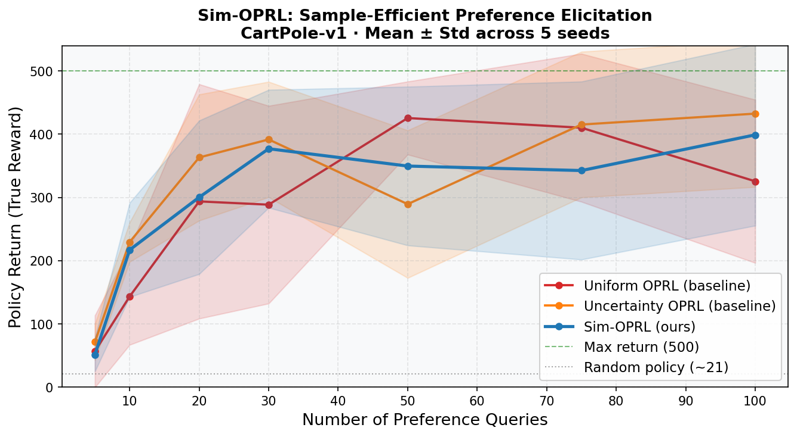

# Sim-OPRL: Preference Elicitation for Offline RL

Reproduction of **[Sim-OPRL (ICLR 2025)](https://arxiv.org/abs/2406.18450)** by Pace, Schölkopf, Rätsch & Ramponi.

## What this demo does

Two CartPole trajectories are simulated using a learned **dynamics model ensemble**, selected by the Sim-OPRL acquisition strategy:

> maximise **reward uncertainty** (we learn the most here) − λ · **transition uncertainty** (stay in-distribution)

Click which trajectory keeps the pole balanced longer. Each click trains the **Bradley-Terry reward model** via preference feedback. Every 5 clicks the policy is re-optimised with REINFORCE on the learned reward — using **no ground-truth reward labels at any point**.

## How to run locally

```bash
pip install -r requirements.txt
python train.py        # collect data + train dynamics model + run comparison
python plot_results.py # generate main figure
python app.py          # launch interactive demo
```

## Results



Sim-OPRL reaches higher policy return with fewer preference queries than both baselines, by asking *informative* questions rather than random ones.
